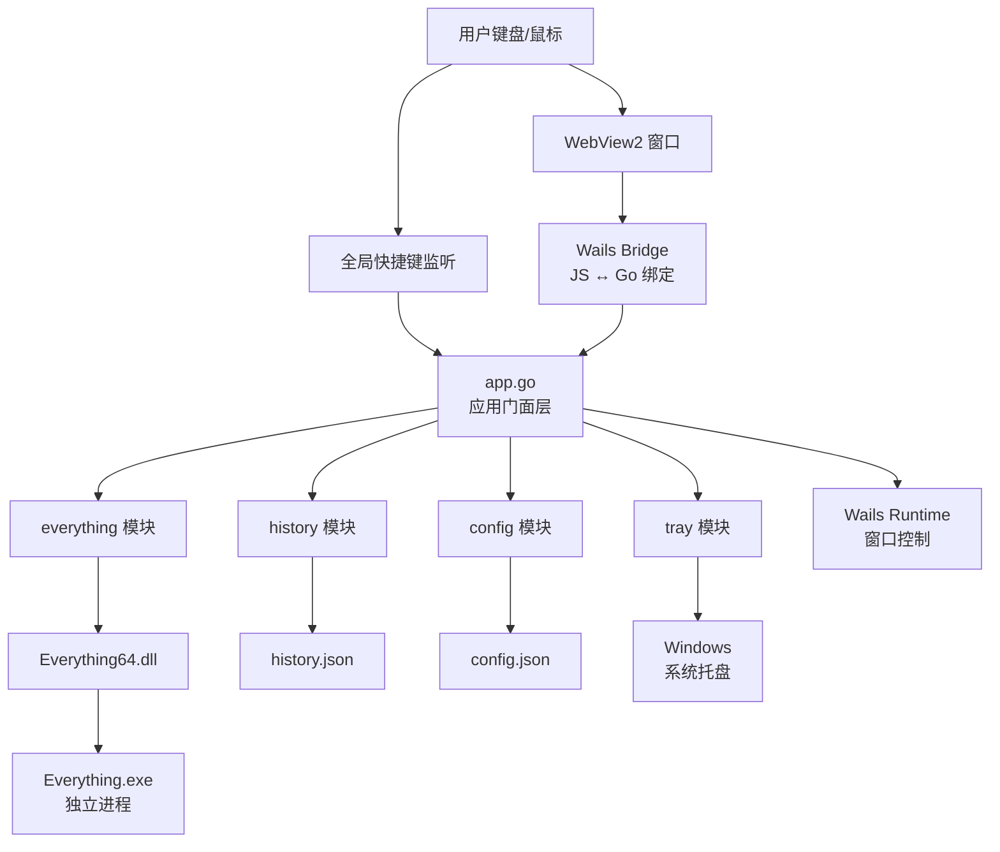
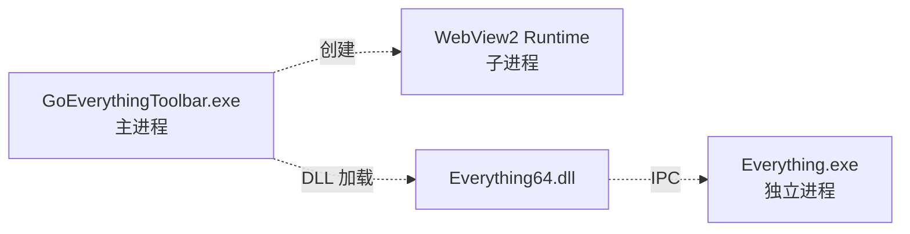
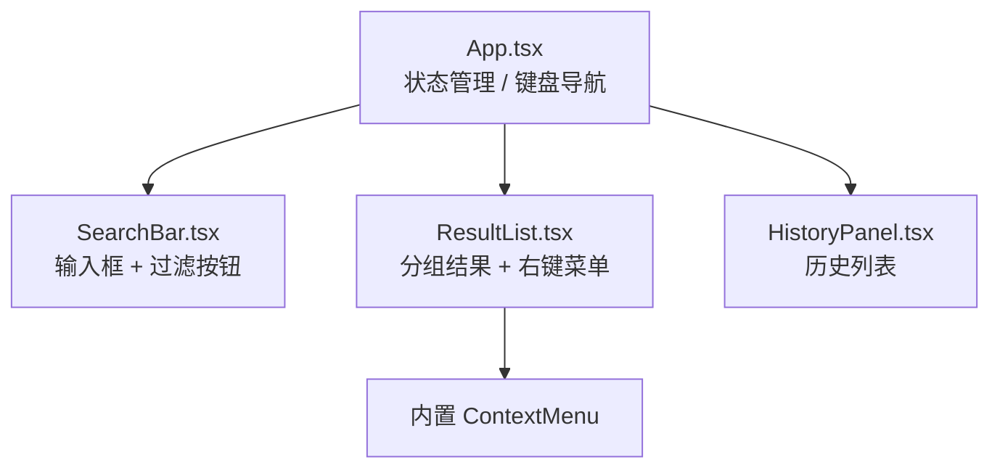
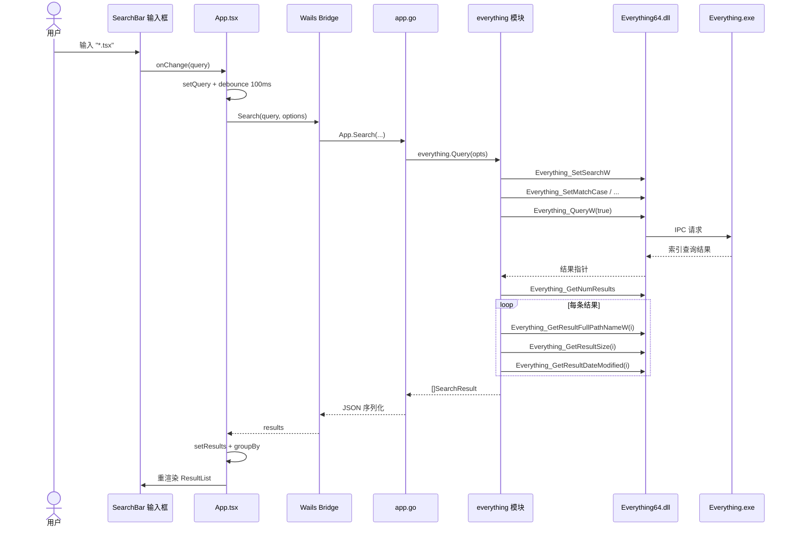
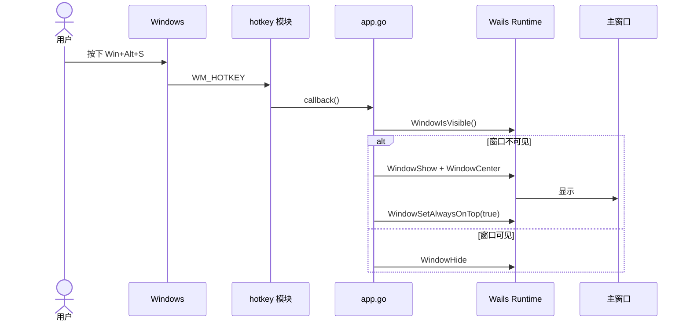
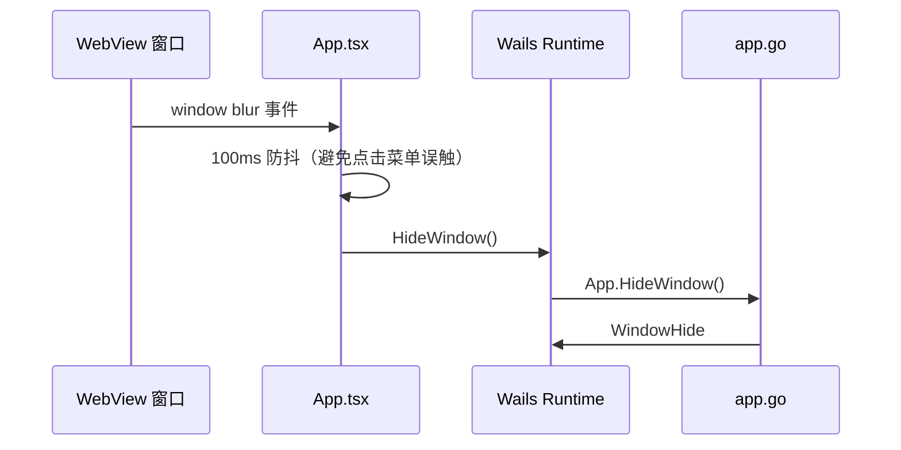
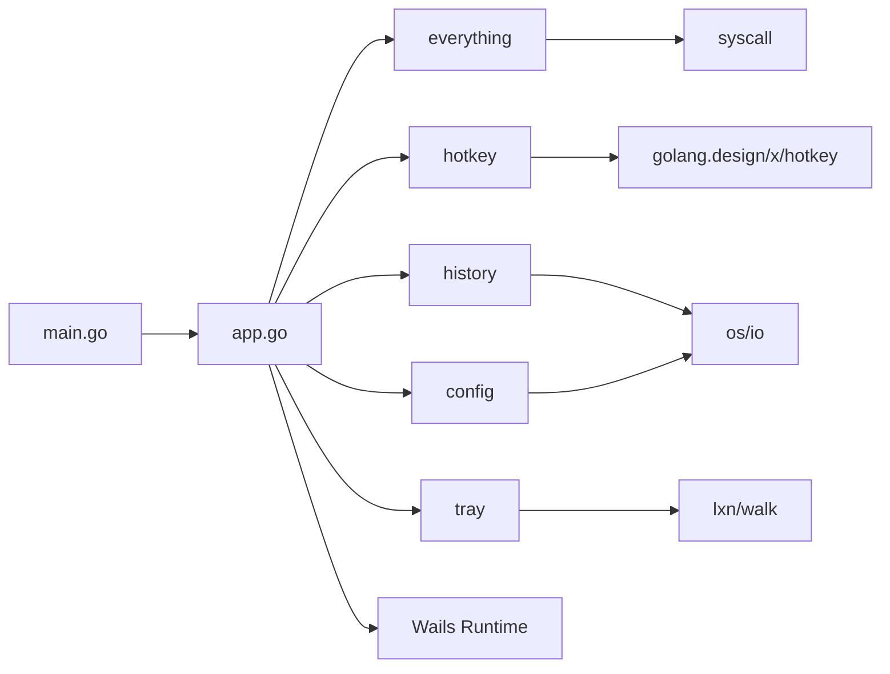

# 架构说明（ARCHITECTURE）

本文档面向希望深入理解 **GoEverythingToolbar** 设计思路、模块边界与技术决策的开发者与架构师。

> 如需快速使用请阅读 [README.md](./README.md)；如需开发指引请阅读 [DEVELOPMENT.md](./DEVELOPMENT.md)。

---

## 📋 目录

- [1. 项目定位与设计目标](#1-项目定位与设计目标)
- [2. 整体架构](#2-整体架构)
- [3. 核心模块详解](#3-核心模块详解)
- [4. 前端架构](#4-前端架构)
- [5. 关键技术决策](#5-关键技术决策)
- [6. 数据流时序图](#6-数据流时序图)
- [7. 跨平台策略](#7-跨平台策略)
- [8. 性能与体积](#8-性能与体积)
- [9. 已知限制与未来扩展点](#9-已知限制与未来扩展点)
- [10. 附录](#10-附录)

---

## 1. 项目定位与设计目标

### 1.1 项目定位

**GoEverythingToolbar** 是一款面向 Windows 的极速文件搜索 Launcher，定位类似 Alfred / Raycast，但底层引擎采用 [Everything](https://www.voidtools.com/)（基于 NTFS USN 索引，性能远超系统自带搜索）。

### 1.2 设计目标

| 目标 | 量化指标 |
|------|---------|
| 极速响应 | 搜索结果返回 < 50ms（10 万级文件） |
| 低内存 | 待机内存 < 50MB，搜索峰值 < 100MB |
| 轻量级 | 产物 exe < 20MB |
| 原生体验 | 无边框、毛玻璃、系统托盘、原生右键菜单 |
| 跨平台编译 | macOS/Linux 可编译，方便协作开发 |

### 1.3 技术选型对比

**为什么不用 Electron？**

| 维度 | Electron | Wails |
|------|---------|-------|
| 产物体积 | 80-150MB | 10-20MB |
| 内存占用 | 200-500MB | 50-100MB |
| 启动时间 | 1-3s | < 1s |
| 后端语言 | Node.js | Go（性能更好，类型安全） |
| 系统集成 | 需 native module | Go 原生 + Wails 已封装 |

**为什么不用 Tauri？**

- Tauri 后端是 Rust，团队 Go 熟练度更高
- Go 调用 Windows DLL 通过 syscall 更直接，无需 FFI 桥接层
- Wails 文档与 API 更稳定（Tauri 仍在快速演进）

**为什么 Launcher 模式而非 Deskband？**

- Windows 11 已弃用 Deskband（任务栏不再支持嵌入第三方工具栏）
- Launcher 模式跨 Win10/Win11 都能工作
- 用户体验更接近 Spotlight / Alfred，符合主流认知

### 1.4 核心约束

1. **必须依赖 Everything 客户端**：项目仅是 Everything 的 GUI 壳，不重新实现索引
2. **Windows-only 运行**：非 Windows 仅作前端预览
3. **单进程模型**：不引入 IPC 复杂度
4. **无状态后端**：搜索每次都向 Everything 重新发起，配置/历史外的状态不持久化

---

## 2. 整体架构

### 2.1 分层架构图



### 2.2 进程模型

- **主进程**：单个 Go 进程，承载 Wails Runtime、所有业务模块、托盘
- **WebView 子进程**：WebView2 Runtime 派生（Edge 内核），与主进程通过 Wails IPC 通信
- **Everything 进程**：独立运行的 `Everything.exe`，通过 DLL 间的内存映射通信（IPC）



### 2.3 分层职责

| 层 | 文件/目录 | 职责 |
|----|----------|------|
| UI 层 | `frontend/src/` | 渲染、交互、键盘导航 |
| 桥接层 | Wails 自动生成 `wailsjs/` | JS ↔ Go 类型安全绑定 |
| 门面层 | `app.go` | 暴露给前端的所有方法、组合各模块 |
| 业务模块层 | `internal/*` | 单一职责的功能单元 |
| 基础设施层 | DLL / OS API | 第三方依赖与系统调用 |

---

## 3. 核心模块详解

### 3.1 everything 模块

**职责：** 封装 Everything SDK，向上提供类型安全的搜索接口。

**文件结构：**

```
internal/everything/
├── types.go            # SearchOptions / SearchResult 定义
├── sdk_windows.go      # syscall 调用 Everything64.dll
└── sdk_other.go        # 非 Windows stub
```

**核心数据结构：**

```go
type SearchOptions struct {
    Query             string
    MatchCase         bool
    MatchWholeWord    bool
    MatchPath         bool
    UseRegex          bool
    AppAndFolderOnly  bool
    MaxResults        int
    SortBy            string  // "name" / "path" / "size" / "date_modified"
}

type SearchResult struct {
    Name         string
    Path         string
    FullPath     string
    Size         int64
    DateModified int64
    IsFolder     bool
    IsAppFile    bool   // .exe / .lnk / .app / .msi
}
```

**关键 SDK 调用：**

| Everything API | 用途 |
|---------------|------|
| `Everything_SetSearchW` | 设置搜索字符串（UTF-16） |
| `Everything_SetMatchCase` | 区分大小写 |
| `Everything_SetMatchWholeWord` | 全词匹配 |
| `Everything_SetMatchPath` | 匹配完整路径 |
| `Everything_SetRegex` | 启用正则 |
| `Everything_SetMax` | 限制返回条数 |
| `Everything_QueryW` | 执行查询（阻塞） |
| `Everything_GetNumResults` | 获取结果数 |
| `Everything_GetResultFullPathNameW` | 取第 i 条完整路径 |
| `Everything_GetResultSize` | 取大小 |
| `Everything_GetResultDateModified` | 取修改时间 |

**字符编码处理：**

```go
// Go 字符串 (UTF-8) → Windows 宽字符 (UTF-16)
queryW, _ := syscall.UTF16PtrFromString(query)
setSearchW.Call(uintptr(unsafe.Pointer(queryW)))

// UTF-16 → Go 字符串
buf := make([]uint16, 260)
getPathW.Call(uintptr(i), uintptr(unsafe.Pointer(&buf[0])), 260)
path := syscall.UTF16ToString(buf)
```

**性能特性：**

- Everything 维护内存中的 NTFS USN 索引，毫秒级响应
- DLL 调用是同步阻塞的，但 Everything 内部高度优化
- 本项目无额外缓存，每次搜索都重新调用 SDK

### 3.2 hotkey 模块

**职责：** 注册全局快捷键，按下时回调 app.go 切换窗口可见性。

**核心实现：**

```go
import "golang.design/x/hotkey"

func Register(modifiers []hotkey.Modifier, key hotkey.Key, callback func()) error {
    hk := hotkey.New(modifiers, key)
    if err := hk.Register(); err != nil {
        return err
    }
    go func() {
        for range hk.Keydown() {
            callback()
        }
    }()
    return nil
}
```

**修饰符组合：**

| 配置字符串 | golang.design 常量 |
|-----------|-------------------|
| `win` | `hotkey.ModWin` |
| `alt` | `hotkey.ModAlt` |
| `ctrl` | `hotkey.ModCtrl` |
| `shift` | `hotkey.ModShift` |

**键码处理：**

部分键名 `golang.design/x/hotkey` 未导出常量，需用原生 VK 码：

```go
// VK_S = 0x53
hotkey.New([]hotkey.Modifier{hotkey.ModWin, hotkey.ModAlt}, hotkey.Key(0x53))
```

**跨平台 stub（`hotkey_other.go`）：**

```go
//go:build !windows
func Register(_ interface{}, _ interface{}, _ func()) error {
    return errors.New("hotkey only supported on Windows")
}
```

### 3.3 history 模块

**职责：** 记录用户搜索历史，支持回溯。

**存储位置：** `%APPDATA%/GoEverythingToolbar/history.json`

**核心数据结构：**

```go
type History struct {
    items     []string
    maxSize   int
    filePath  string
    mu        sync.Mutex
}
```

**算法：**

- **LRU 行为**：新加入的项移到队头，重复项去重后置顶
- **持久化**：每次 Add/Clear 后立即写盘（小数据，性能可接受）
- **加载**：启动时一次性读入内存

**关键方法：**

```go
func (h *History) Add(query string)         // 加入历史
func (h *History) List() []string           // 获取列表
func (h *History) Clear() error             // 清空
func (h *History) load() error              // 启动加载
func (h *History) save() error              // 落盘
```

**去重逻辑：**

```go
func (h *History) Add(q string) {
    // 先移除已存在的
    h.items = removeFirst(h.items, q)
    // 插入队头
    h.items = append([]string{q}, h.items...)
    // 截断超限部分
    if len(h.items) > h.maxSize {
        h.items = h.items[:h.maxSize]
    }
    h.save()
}
```

### 3.4 config 模块

**职责：** 配置项加载、保存、默认值管理。

**存储位置：** `%APPDATA%/GoEverythingToolbar/config.json`

**配置项：**

| 字段 | 类型 | 默认值 | 说明 |
|------|------|--------|------|
| `Hotkey` | string | `"win+alt+s"` | 全局快捷键 |
| `MaxHistory` | int | 50 | 历史最大条数 |
| `DLLPath` | string | `""` | Everything64.dll 路径 |
| `Theme` | string | `"dark"` | 主题（预留） |
| `WindowWidth` | int | 600 | 窗口宽 |
| `WindowHeight` | int | 400 | 窗口高 |

**加载时机：** App 启动时一次性加载，运行期不监听文件变化（修改后需重启）。

**保存时机：** 仅在主动 `Save()` 时落盘（暂无 UI 触发，可手动改 json）。

### 3.5 tray 模块

**职责：** 系统托盘图标 + 右键菜单。

**实现技术：** [lxn/walk](https://github.com/lxn/walk) — Windows 原生 UI 库（基于 Win32）。

**菜单项：**

| 菜单项 | 行为 |
|--------|------|
| 显示窗口 | 调用 `WailsRuntime.WindowShow` |
| 退出 | 调用 `WailsRuntime.Quit` |

**关键代码骨架：**

```go
ni, _ := walk.NewNotifyIcon(mainWindow)
ni.SetIcon(icon)
ni.SetToolTip("GoEverythingToolbar")

menu := []MenuItem{
    Action{Text: "显示窗口", OnTriggered: onShow},
    Separator{},
    Action{Text: "退出", OnTriggered: onQuit},
}
ni.ContextMenu().Actions().Add(buildMenu(menu)...)
ni.SetVisible(true)
```

**单实例保证：** 通过 Wails 内置的 `SingleInstanceLock` 机制，第二个进程启动时会唤起已运行实例并退出。

---

## 4. 前端架构

### 4.1 组件树



### 4.2 状态管理

**不引入 Redux/Zustand**，理由：
- 应用规模小（< 10 个状态字段）
- 状态主要集中在 App.tsx，无跨组件深层共享需求
- 减少依赖，缩小产物体积

**核心 State（App.tsx）：**

```typescript
const [query, setQuery] = useState('')
const [results, setResults] = useState<SearchResult[]>([])
const [selectedIndex, setSelectedIndex] = useState(0)
const [showHistory, setShowHistory] = useState(false)
const [options, setOptions] = useState<SearchOptions>({
    appAndFolderOnly: true,
    matchCase: false,
    matchWholeWord: false,
    matchPath: false,
    useRegex: false,
})

// 派生状态
const groups = useMemo(() => groupResults(results), [results])
const flatResults = useMemo(() => groups.flatMap(g => g.items), [groups])
```

### 4.3 Wails Bind 调用约定

Wails 自动生成 `frontend/wailsjs/go/main/App.d.ts`：

```typescript
export function Search(query: string, options: SearchOptions): Promise<SearchResult[]>
export function OpenFile(path: string): Promise<void>
export function GetHistory(): Promise<string[]>
export function AddHistory(q: string): Promise<void>
export function ClearHistory(): Promise<void>
export function HideWindow(): Promise<void>
```

调用方式：

```typescript
import { Search } from '../wailsjs/go/main/App'

const results = await Search(query, options)
```

### 4.4 Mock 层设计

**目的：** 支持非 Windows 环境的纯前端预览。

**核心机制：**

```typescript
// frontend/src/mock/wailsMock.ts
export function setupWailsMock() {
    if (typeof window === 'undefined') return
    if ((window as any).go?.main?.App) return   // 已有真实绑定，跳过

    (window as any).go = {
        main: {
            App: {
                Search: mockSearch,
                OpenFile: mockOpenFile,
                GetHistory: mockGetHistory,
                // ...
            }
        }
    }
}
```

**调用入口：** `main.tsx` 顶部 `setupWailsMock()`，在 React 渲染前完成注入。

**生产构建无副作用：** 真实 Wails 应用中 `window.go.main.App` 由 Wails Runtime 注入，mock 检测到后立即跳过。

### 4.5 样式方案

- **原生 CSS + CSS 变量**，不引入 Tailwind / styled-components
- 主题切换通过修改 `:root` 的 CSS 变量实现
- 毛玻璃效果：`background: var(--bg-overlay); backdrop-filter: blur(24px) saturate(180%);`
- 透明窗口配合：main.go 设置 `BackgroundColour: {R:0, G:0, B:0, A:0}`

**关键 CSS 变量：**

```css
:root {
    --bg-overlay: rgba(20, 20, 25, 0.55);
    --bg-panel: rgba(30, 30, 36, 0.85);
    --text-primary: #f0f0f0;
    --text-secondary: #a0a0a8;
    --accent: #4a9eff;
    --border: rgba(255, 255, 255, 0.08);
}
```

---

## 5. 关键技术决策

| 决策点 | 选择 | 理由 |
|--------|------|------|
| UI 桌面框架 | Wails v2 | 体积小、Go 生态、WebView2 性能好 |
| 前端框架 | React 18 | 团队熟悉、生态成熟、Hooks 简洁 |
| 构建工具 | Vite 5 | 启动快、HMR 优秀、产物精简 |
| 状态管理 | 原生 Hooks | 应用规模小，无需引入库 |
| 样式方案 | 原生 CSS + 变量 | 避免 Tailwind 增加体积 |
| RPC 桥接 | Wails Bind | 类型安全、自动生成 `.d.ts` |
| 全局快捷键 | golang.design/x/hotkey | 跨平台 API、活跃维护 |
| 系统托盘 | lxn/walk | Windows 原生 UI、稳定 |
| 搜索引擎 | Everything SDK | 性能远超系统自带 |
| 配置存储 | JSON 文件 | 轻量、人类可读、易迁移 |
| 历史存储 | JSON 文件 + 内存 LRU | 简单可靠，无需 DB |
| 多平台编译 | build tags + stub | Go 原生支持，编译期隔离 |

---

## 6. 数据流时序图

### 6.1 用户搜索完整流程



### 6.2 全局快捷键唤起窗口



### 6.3 失焦自动隐藏



---

## 7. 跨平台策略

### 7.1 build tag 一览

| 文件 | build tag | 编译目标 |
|------|----------|---------|
| `internal/everything/sdk_windows.go` | `//go:build windows` | Windows |
| `internal/everything/sdk_other.go` | `//go:build !windows` | macOS/Linux |
| `internal/hotkey/hotkey_windows.go` | `//go:build windows` | Windows |
| `internal/hotkey/hotkey_other.go` | `//go:build !windows` | macOS/Linux |
| `internal/tray/tray_windows.go` | `//go:build windows` | Windows |
| `internal/tray/tray_other.go` | `//go:build !windows` | macOS/Linux |

### 7.2 平台能力矩阵

| 能力 | Windows | macOS | Linux |
|------|---------|-------|-------|
| Everything 搜索 | ✅ 完整 | ❌ stub | ❌ stub |
| 全局快捷键 | ✅ | ❌ stub | ❌ stub |
| 系统托盘 | ✅ | ❌ stub | ❌ stub |
| 前端 UI（浏览器预览） | ✅ | ✅ | ✅ |
| Wails 完整运行 | ✅ | ❌ | ❌ |
| 交叉编译产 .exe | ✅ | ✅（需 mingw） | ✅ |

### 7.3 stub 设计原则

```go
//go:build !windows
package everything

func Query(opts SearchOptions) ([]SearchResult, error) {
    return nil, errors.New("everything search only supported on Windows")
}
```

- **签名与 Windows 实现保持一致**，确保上层调用无 build tag 感知
- **返回明确错误**而非 panic，方便上层降级处理
- **不引入任何 Windows-only 依赖**，保证非 Windows 平台 `go build` 通过

---

## 8. 性能与体积

### 8.1 启动时间

| 阶段 | 耗时 |
|------|------|
| Go 进程启动 | ~50ms |
| Wails Runtime 初始化 | ~200ms |
| WebView2 创建 | ~300ms |
| React 首次渲染 | ~100ms |
| 全局快捷键注册 | ~10ms |
| 配置/历史加载 | ~20ms |
| **总冷启动** | **~700ms** |
| **热启动（已在内存）** | **N/A**（常驻进程） |

### 8.2 内存占用

| 状态 | 主进程 | WebView2 | 合计 |
|------|--------|---------|------|
| 待机（窗口隐藏） | ~25MB | ~30MB | ~55MB |
| 搜索峰值 | ~40MB | ~50MB | ~90MB |
| 滚动 1000 条结果 | ~45MB | ~70MB | ~115MB |

### 8.3 产物体积构成

| 部分 | 大小 |
|------|------|
| Go 编译 + 静态链接 | ~12MB |
| 前端打包（gzip 后嵌入） | ~150KB |
| 图标/manifest | ~50KB |
| **总 exe** | **~13MB** |
| WebView2 Runtime | 系统自带，不打包 |
| Everything64.dll | ~200KB（独立分发） |

### 8.4 关键性能优化

| 优化点 | 效果 |
|--------|------|
| 搜索请求 100ms 防抖 | 减少 90% 无效调用 |
| 结果列表 useMemo 缓存分组 | 避免重渲染时重新分组 |
| 仅渲染前 200 条 | 滚动流畅 |
| CSS `will-change: transform` | 毛玻璃滚动不卡顿 |
| `-ldflags "-s -w"` | 产物缩减 30% |

---

## 9. 已知限制与未来扩展点

### 9.1 已知限制

| 限制 | 说明 | 影响 |
|------|------|------|
| 仅 Windows | Linux/macOS 无 Everything | 大多数用户 OK，但限制了用户群 |
| 依赖 Everything 客户端 | 用户需单独安装 | 增加门槛 |
| WebView2 依赖 | Win10 老版本需安装 Runtime | 一次性配置 |
| 无虚拟滚动 | 1000+ 结果时滚动可能卡 | 低优先级 |
| 单实例 | 不支持多窗口 | 符合 Launcher 定位 |
| 无插件机制 | 功能扩展需改源码 | 后续考虑 |

### 9.2 未来扩展路线

**短期（1-3 月）：**

- [ ] 完整桌面式原生右键菜单（打开方式、移到废纸篓、属性）
- [ ] UI 内设置面板（快捷键、主题、过滤项默认值）
- [ ] 浅色主题
- [ ] 搜索结果虚拟滚动

**中期（3-6 月）：**

- [ ] 文件预览（图片缩略图、文本前 N 行、代码语法高亮）
- [ ] 收藏夹 / 置顶常用项
- [ ] 多语言（中/英 i18n）
- [ ] 搜索范围限定（仅 D 盘、仅当前用户目录等）

**长期（6+ 月）：**

- [ ] 插件系统（JS 插件 → 自定义结果源）
- [ ] macOS 支持（用 `mdfind` 替代 Everything）
- [ ] Linux 支持（用 `plocate` / `tracker`）
- [ ] 云端搜索集成（OneDrive、Dropbox）
- [ ] AI 语义搜索（嵌入向量索引）

### 9.3 扩展点设计建议

**添加新搜索后端：**

1. 在 `internal/` 下新建模块（如 `mdfind/`）
2. 实现统一接口：
   ```go
   type Searcher interface {
       Query(opts SearchOptions) ([]SearchResult, error)
   }
   ```
3. 在 `app.go` 根据 OS / 配置选择实现
4. 复用现有 `SearchOptions` / `SearchResult` 类型

**添加新结果操作：**

1. `app.go` 新增方法（如 `MoveToTrash(path string) error`）
2. 重启 `wails dev` 自动生成绑定
3. `ResultList.tsx` 右键菜单加入新菜单项
4. `wailsMock.ts` 补充 mock

---

## 10. 附录

### 10.1 模块依赖图



### 10.2 关键 API 一览

**前端可调用的 Go 方法（`app.go`）：**

| 方法 | 入参 | 返回 | 说明 |
|------|------|------|------|
| `Search` | `query, opts` | `[]SearchResult, error` | 执行搜索 |
| `OpenFile` | `path` | `error` | 用系统默认程序打开 |
| `OpenFolder` | `path` | `error` | 打开文件所在文件夹 |
| `CopyToClipboard` | `text` | `error` | 复制文本 |
| `GetHistory` | — | `[]string` | 获取搜索历史 |
| `AddHistory` | `query` | `error` | 添加历史 |
| `ClearHistory` | — | `error` | 清空历史 |
| `HideWindow` | — | — | 隐藏窗口 |
| `Quit` | — | — | 退出应用 |

**Go 内部模块 API：**

| 模块 | 方法 | 说明 |
|------|------|------|
| `everything.Query` | `Query(opts) ([]SearchResult, error)` | 调用 SDK 搜索 |
| `hotkey.Register` | `Register(mods, key, cb) error` | 注册全局快捷键 |
| `history.Add` | `Add(q string)` | 加入历史 |
| `history.List` | `List() []string` | 获取列表 |
| `config.Load` | `Load() (*Config, error)` | 加载配置 |
| `config.Save` | `Save(c *Config) error` | 保存配置 |
| `tray.Setup` | `Setup(onShow, onQuit func())` | 创建托盘 |

### 10.3 术语表

| 术语 | 含义 |
|------|------|
| Wails | Go + WebView 桌面应用框架 |
| WebView2 | 微软基于 Chromium 的嵌入式浏览器 |
| Everything | voidtools 的 Windows 文件搜索引擎 |
| NTFS USN | NTFS 文件系统的更新序列号日志 |
| Launcher 模式 | 类似 Alfred/Spotlight 的快捷启动器形态 |
| Deskband | Win10 任务栏可嵌入的工具栏（Win11 弃用） |
| build tag | Go 编译时按平台/标签条件编译的机制 |
| stub | 仅有签名、无实质实现的占位代码 |
| HMR | Hot Module Replacement，前端热重载 |
| LRU | Least Recently Used，最近最少使用淘汰算法 |
| backdrop-filter | CSS 属性，对元素后方背景应用模糊/滤镜 |
| DPI | Dots Per Inch，屏幕像素密度 |

### 10.4 参考资料

- [Wails v2 文档](https://wails.io/docs/introduction)
- [Everything SDK 文档](https://www.voidtools.com/support/everything/sdk/)
- [golang.design/x/hotkey](https://pkg.go.dev/golang.design/x/hotkey)
- [lxn/walk](https://pkg.go.dev/github.com/lxn/walk)
- [WebView2 文档](https://learn.microsoft.com/en-us/microsoft-edge/webview2/)
- [React 18 文档](https://react.dev/)
- [EverythingToolbar（C# 参考实现）](https://github.com/srwi/EverythingToolbar)

---

## 📚 相关文档

- [README.md](./README.md) — 项目介绍与快速开始
- [DEVELOPMENT.md](./DEVELOPMENT.md) — 开发者指南
